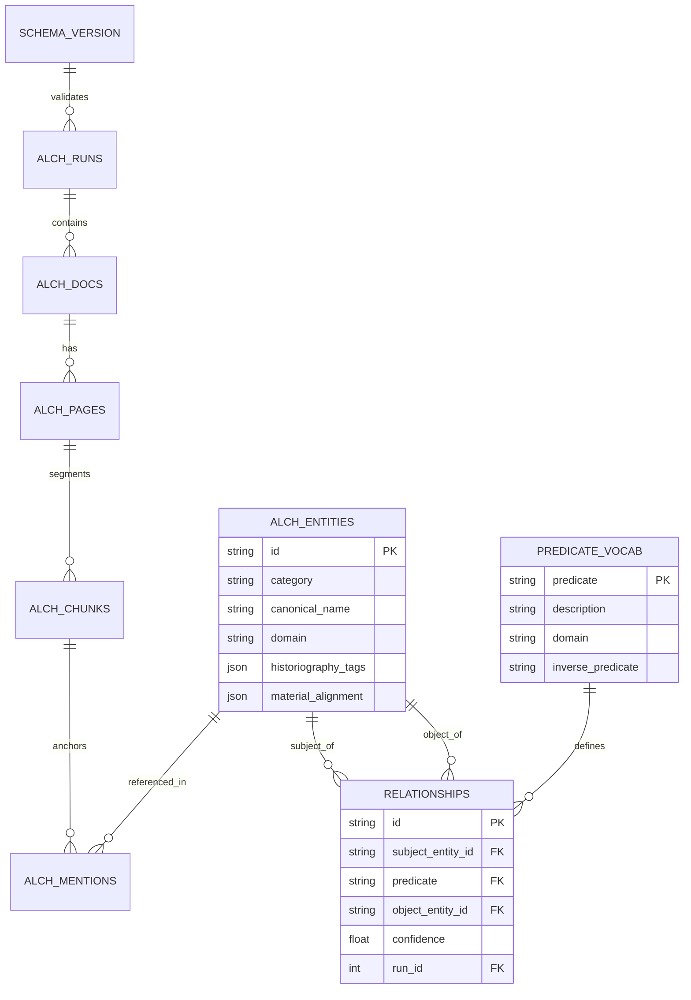

# V3 Knowledge Graph: ER Diagram & Ontology Spec

## 1. Unified Entity-Relationship Model (Mermaid)

## 2. Controlled Predicate Ontology

| Predicate | Description | Domain | Inverse |
| :--- | :--- | :--- | :--- |
| `mentions` | Basic textual reference to an entity. | general | `mentioned_by` |
| `influenced_by` | Creative or intellectual lineage. | general | `influenced` |
| `analog_of` | Symbolic or chemical correspondence (e.g., Sun -> Gold). | alchemy | `analog_of` |
| `member_of` | Group/Guild membership (Artisanal context). | general | `has_member` |
| `uses_tool` | Connection between alchemist and apparatus. | alchemy | `tool_used_by` |
| `reconstruction_of` | Modern laboratory replication of a historic recipe. | alchemy | `source_for_reconstruction` |

## 3. Structural Soundness & Fragility Audit

### Structural Soundness
- **Hash-Anchored Chunking**: Prevents data loss during file moves.
- **Migration Registry**: Ensures all nodes in a cluster (or future distributed dev environments) share a consistent schema.

### Hidden Fragilities
- **Predicate Ambiguity**: Without the `predicate_vocab` check, users might create redundant predicates (e.g., `part_of` vs `member_of`).
- **Domain Drift**: We must enforce that an entity in the `comics` domain cannot have an `analog_of` relationship with an `alchemy` process unless explicitly whitelisted.
- **SQLite Locking**: High-velocity Relationship extraction (The "Loom") may hit write-contention. We should implement a "Relationship Buffer" in-memory before batch inserting.
